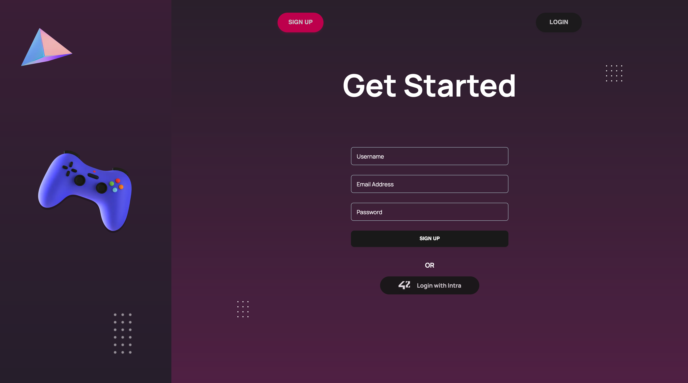

# ft_transcendence

Welcome to ft_transcendence, a web application built for the mighty pong contest. This project challenges you to work with unconventional technologies and frameworks, pushing you to explore new territories in computer science.

## Table of Contents
- [Overview](#overview)
- [Security Concerns](#security-concerns)
- [User Account](#user-account)
- [Chat-](#cha)
- [Game](#game)
- [Guilds](#guilds)
- [Tournament](#tournament)
- [Admin](#admin)

## Overview
ft_transcendence is a web application that facilitates Pong tournaments, real-time multiplayer games, and more. The tech stack includes nestjs for the backend, PostgreSQL for the database, and nextjs for the front-end. The deployment is streamlined with Docker-compose.

## Security Concerns
- Passwords are encrypted in the database.
- Protection against SQL injections is implemented.
- Server-side validation is applied to forms and user input.

## User Account
- Users authenticate using the 42 intranet OAuth system.
- Unique display names are chosen by users.
- Comprehensive user statistics and achievements tracking.
- Avatar generation or upload.
- Two-factor authentication options.
- Guild affiliation, friend system, and match history.

## Chat
- Public/private channels creation.
- Direct messages between users.
- User blocking functionality.
- Channel ownership and administration.
- Ban or mute users by administrators.
- Chat integration with game invitations and player profiles.

## Game
- Pong game directly on the website.
- Live multiplayer gameplay with network considerations.
- Responsive design.
- Optional features like power-ups and different maps.

## Guilds
- Users can create guilds with unique names.
- Unique anagrams assigned to guild members.
- Guild points system based on member wins.
- Guild ranking visible to users.
- Guild wars with start/end dates, points, and war times.
- War history page for each guild.

## Tournament
- Permanent ladder tournament with a matchmaking system.
- Casual and rated gameplay.
- Administrator-created or automated tournaments with various rules (round robin, single/double eliminations, swiss).
- User registration for tournaments with incentives.

## Admin
- Administrators can create tournaments.
- Manage chat channels, including destruction and access.
- Ban users.
- Access chat channels without being listed.
- Manage user rights in chat channels and guilds.

## Getting Started
1. Clone the repository: `git clone https://github.com/funke09/Ft_Trancendence_42.git`
2. Navigate to the project directory: `cd Ft_Trancendence_42`
3. Build and run the application: `docker-compose up --build`
